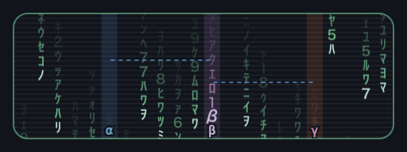
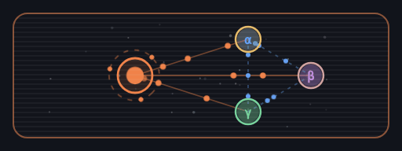
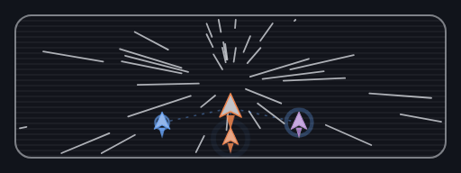
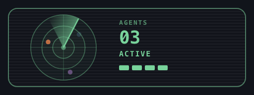
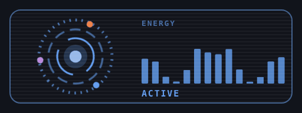
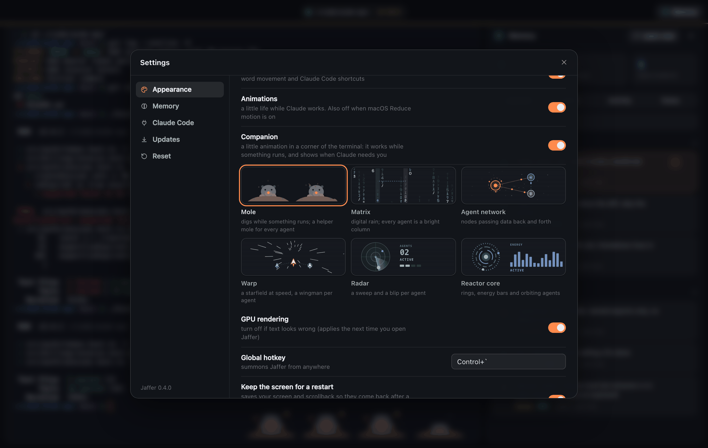

<p align="center">
  
</p>

<h1 align="center">Jaffer</h1>
<p align="center"><b>A calm macOS terminal with one session that never ends, a memory that learns from you,<br />and a companion that shows what Claude Code is doing.</b></p>

<p align="center">
  <a href="https://github.com/jafforgehq/jaffer/actions/workflows/ci.yml"></a>
  <a href="https://github.com/jafforgehq/jaffer/releases/latest"></a>
  
  <a href="LICENSE"></a>
</p>

<p align="center">
  <a href="#install">Install</a> ·
  <a href="#features">Features</a> ·
  <a href="#companions">Companions</a> ·
  <a href="#claude-code">Claude Code</a> ·
  <a href="#memory">Memory</a> ·
  <a href="#development">Development</a> ·
  <a href="docs/ARCHITECTURE.md">Architecture</a>
</p>

<p align="center">
  
</p>

## Why Jaffer

- **One session, always.** No tabs of throw-away shells and no "new chat". Your shell, its processes and your scrollback live in a background daemon. Quit the app or close the lid and you come back to exactly where you were, with a running Claude Code still going. After a reboot you get the same folder and the same screen above a fresh shell.
- **A memory that evolves by itself.** Jaffer distils what is worth keeping from what you do (preferences, each project's conventions, fixes that cost you an hour, routines you repeat), merges what repeats, lets stale things fade and hands the result to Claude Code. You can see it, edit it, pin it and undo any change.
- **Life when something happens.** A small animation in the corner works while a command or Claude works, sits up when Claude needs you and celebrates when a turn ends. Choose a mole, digital rain, an agent network, a starfield, a radar or a reactor core.

Claude Code is **optional**. It runs inside Jaffer like anywhere else (real TTY, truecolor, mouse, `Shift+Enter`); connect it and the companion, the notifications and a per-answer cost figure follow it.

## Install

Download the `.dmg` for your Mac (Apple Silicon `arm64` or Intel `x64`) from [Releases](https://github.com/jafforgehq/jaffer/releases) and drag Jaffer to Applications. Releases are signed and notarized and come with a `SHA256SUMS.txt`; how they are built and published is in [docs/SIGNING.md](docs/SIGNING.md). An unsigned preview built by CI needs `xattr -dr com.apple.quarantine /Applications/Jaffer.app` once.

To build it yourself (a local build opens with no warnings): `./scripts/install-mac.sh` (Node 22+).

**Updates ask first.** The signed app checks for a new release, downloads it in the background and then asks *Update and restart* or *Later*. Updating ends your terminal session, so the prompt says so, and nothing installs without your yes, not even on quit. The background check can be switched off in *Settings → Updates*.

On first launch Jaffer asks what it may do: sign in to Claude or use a plain terminal, learn from your sessions, follow Claude Code, start `claude` for you. Nothing is on until you say so.

## Features

| | |
|---|---|
| **Terminal** | A thin title bar (folder, branch, a ring that spins only while something really runs) and nothing else. Eleven themes that restyle the whole app, previewed live. |
| **Companion** | Six animated corner scenes that follow your commands and Claude Code, with a helper per background agent. [More below.](#companions) |
| **Claude Code** | A notification when Claude needs you and when a long turn finishes (how long it took and what it cost). A per-answer cost estimate. One-click **Resume Claude** after a restart. [More below.](#claude-code) |
| **Memory** | Cards with kind, confidence, source and age, pins, and a log of every change with **Undo** (`⇧⌘M`). [More below.](#memory) |
| **Safety** | A thin amber edge on a protected branch (`main`, `master`, `production`, `prod`, `release/*` by default) and a red one that names the host while `ssh` runs, so a command goes where you meant. |
| **Privacy** | Secrets are redacted before anything is stored or sent; commands like `env` or `cat ~/.ssh/…` are never recorded. No API key anywhere: Claude subscriptions only. |

**Keys:** `⇧⌘M` memory · `⌘P` command palette · `⇧⌘C` run Claude Code · `⌘K` clear · `⌘F` find · `⌘+` / `⌘-` text size · `` ⌃` `` summon Jaffer from anywhere · drag a file in to paste its path. `⌘W` hides the window and `⌘Q` quits the app, **but the session keeps running**; `⌥⌘Q` ends it. There is exactly one session and one terminal, by design (use `tmux` inside it if you want panes).

| | |
|---|---|
| <br><sub>**It tells you when it needs you.** The companion sits up with a `!`, and a notification follows if the window is behind.</sub> | <br><sub>**Memory you can see** (`⇧⌘M`): where each item came from, every change undoable.</sub> |
| <br><sub>**Claude Code settings:** sign-in help, hooks, memory tools, notifications, resume and the cost switch.</sub> | <br><sub>**Updates ask first**, because updating ends your terminal session.</sub> |
| <br><sub>**First launch.** Nothing is on until you say so; a plain terminal is one click.</sub> | <br><sub>**Light theme**, same calm layout (one of eleven).</sub> |

<sub>The screenshots are the real app, generated by `npm run screenshots` from a scripted demo session (real git repo, real zsh, real memory engine; only Claude Code's hook events and its token counts are scripted so the run is deterministic).</sub>

## Companions

Pick one in *Settings → Appearance* (each choice is shown live there), or switch the companion off.

| | | |
|---|---|---|
| <br><sub>**Mole.** Digs while something runs; a helper mole for every agent.</sub> | <br><sub>**Matrix.** Digital rain; every agent is a bright column.</sub> | <br><sub>**Agent network.** Nodes passing data back and forth.</sub> |
| <br><sub>**Warp.** A starfield at speed, a wingman per agent.</sub> | <br><sub>**Radar.** A sweep and a blip per agent.</sub> | <br><sub>**Reactor core.** Rings, energy bars and orbiting agents.</sub> |

<p align="center">
  
</p>

All six behave the same way. They sleep when nothing runs, rest while Claude Code is open, work while a command or Claude works, sit up with an alert when Claude needs you, and celebrate when a turn ends. **The longer the work takes, the harder they go**: faster after 30 seconds, strained after 2 minutes, at full tilt after 5. **Every background agent brings a helper** (up to three) that celebrates when its agent finishes.

They are decoration only: they ignore the mouse, stand still with *Settings → Appearance → Animations* off or macOS *Reduce motion* on, take their colours from the theme, and never type or send anything.

## Claude Code

There is exactly one Claude: the `claude` in your terminal (`⇧⌘C`, or just type it). You talk to it there, with its own permission prompts; Jaffer adds no second chat or panel. Claude Code reports what it does through hooks, and Jaffer turns that into the companion, the title-bar ring, the notifications and the cost figure. It follows only a `claude` running in Jaffer's own terminal, redacts everything it handles, and notices a declined prompt or `Esc` from the transcript (Claude Code fires no hook for those).

Jaffer runs on Claude **subscriptions** only: there is no API key anywhere (`ANTHROPIC_API_KEY` is ignored), and whether you are signed in comes from `claude auth status`. Sign-in opens your browser and nothing is typed into your terminal for it.

- **Resume after a restart.** A reboot, an update or a crash ends the shell and Claude Code with it. When Jaffer comes back in the same folder, a quiet **Resume Claude** button in the title bar types `claude --resume <id>` for that conversation, only when you click it, and not after you quit Claude on purpose.
- **What each answer cost.** After every answer a figure like `≈ $0.04` appears in the title bar; hover for the tokens and the session total. It is an **estimate**: Jaffer adds up the token counts in Claude Code's own transcript (numbers only, never the words) at Anthropic's API list prices. On a subscription nothing is billed per token, so read it as what the work would be worth. A model without a known price shows tokens, not a guess, and background agents' own usage is not counted.
- **Notifications** while the window is in the background: Claude needs you, a long turn finished, a long command finished. Each one can be switched off in *Settings → Claude Code*.

`jaffer setup claude` (or *Settings → Claude Code → Add memory tools*) wires Claude Code in fully and reversibly (`--remove`):

- an **MCP server** (`jaffer_context`, `jaffer_recall`, `jaffer_remember`, `jaffer_forget`) so Claude can look things up and save lessons itself;
- a **SessionStart hook**: every session, also after `/compact`, starts with what Jaffer knows about this project and you;
- a **Stop hook** and **transcript learning** (local, read-only), whether you ran Claude in Jaffer or elsewhere;
- **live hooks** (prompts, tools, subagents, notifications) that report only from Jaffer's terminal and never delay Claude;
- optional exports: a marked block in `~/.claude/CLAUDE.md`, and learned routines published as real Claude Code skills.

Your own hooks and settings are never touched, only entries tagged `jaffer-managed`.

## Memory

- **Observe.** Shell integration records commands, exit codes and folders (no dotfile edits), and Claude Code transcripts are added. Everything is redacted for secrets before it is written.
- **Reflect** every ~20 events or when you go idle. Deterministic rules always run (package manager, how to test and build, recurring failure→fix pairs, repeated routines, "always use pnpm"); with your consent a model also curates, and a correction ("no, use pnpm") is the strongest signal.
- **Consolidate** daily: merge near-duplicates, fade what is never reinforced (pinned items never fade), cap sizes.
- **Inject** only what is relevant to the project, at session start or on request through MCP.
- **Stay in control.** Every change is journaled: `jaffer memory log`, `jaffer memory revert <run>` or the Undo button. `~/.jaffer/memory/NOTES.md` is yours and is never rewritten.

Memory lives in `~/.jaffer/memory`. The only network traffic is what you enable: model curation of redacted summaries, through your own Claude login (`claude -p`).

## The session and the command line

The app is a window onto a background daemon (`jafferd`, a unix socket in `~/.jaffer/run`) that owns your shell, a headless copy of the screen, what Claude Code is doing and the memory. Re-attaching restores the exact screen, including full-screen programs. To survive a reboot the screen and scrollback are saved in `~/.jaffer/session` (mode 0600, unredacted, because it is your terminal). Switch that off in *Settings → Appearance → Keep the screen for a restart* and nothing of the screen is kept on disk (the folder still comes back); *Settings → Reset* removes it too.

```sh
jaffer remember "Always run the linter before committing" --kind convention
jaffer recall linter      jaffer forget linter      jaffer context
jaffer memory [list|log|reflect|consolidate|revert <run>]
jaffer status | doctor    jaffer setup claude [--remove|--status]
```

Inside Jaffer `jaffer` is already on your `PATH`; elsewhere run *Install the `jaffer` command* from the palette.

**Start over:** *Settings → Reset → Reset…*, or `jaffer reset` from another terminal (`--yes` skips the question, `--delete` skips the backup). It ends the session and removes `~/.jaffer` (moved aside as `~/.jaffer.backup-<time>` unless you delete it), Jaffer's hooks and memory tools in Claude Code, the block it wrote into `~/.claude/CLAUDE.md`, the skills it published, the `jaffer` link and the app's data. Claude Code itself, its login and your own settings stay. Then drag Jaffer.app to the Trash.

## Development

```sh
npm ci && npm run build        # esbuild: daemon, CLI, Electron main/preload, renderer
npm run dev                    # build + launch
npm run typecheck && npm test  # real PTYs (bash, zsh), the bundled daemon and CLI as processes, the real `claude` against a mock API
npm run test:e2e               # the real UI in headless Chromium against the real daemon (set JAFFER_CHROME)
npm run screenshots            # regenerate docs/screenshots; then python3 scripts/shrink-screenshots.py
scripts/release-mac.sh         # on your Mac: build, sign, notarize, verify; --publish uploads it
```

`src/core` has no Electron dependency, so nearly everything is tested as real processes. CI runs the suite on Linux and macOS, builds the `.app`, boots it in a smoke test (`JAFFER_SMOKE=1`) and checks signing end to end with a throwaway identity. See [docs/ARCHITECTURE.md](docs/ARCHITECTURE.md) and [CLAUDE.md](CLAUDE.md) for the layout and the rules that matter.

**Not verified here:** a real Claude sign-in (tests use the real `claude` binary against a mock API and a stand-in for the login page); the companions and the cost figure against a real Claude Code session (their inputs were checked against real hook payloads and transcript fields, then driven by scripted events); `claude --resume` against a real conversation; clicking *Update and restart* through to the new version; and, needing a person at a Mac, notifications, the global hotkey and the WebGL renderer on your GPU.

## Limitations

- macOS only. Fish integration is experimental (zsh and bash are tested).
- No Claude panel by design: you answer Claude Code's permission prompts in the terminal.
- Built on xterm.js (WebGL): fast, but not a native GPU terminal like Ghostty.

## License

[MIT](LICENSE)
