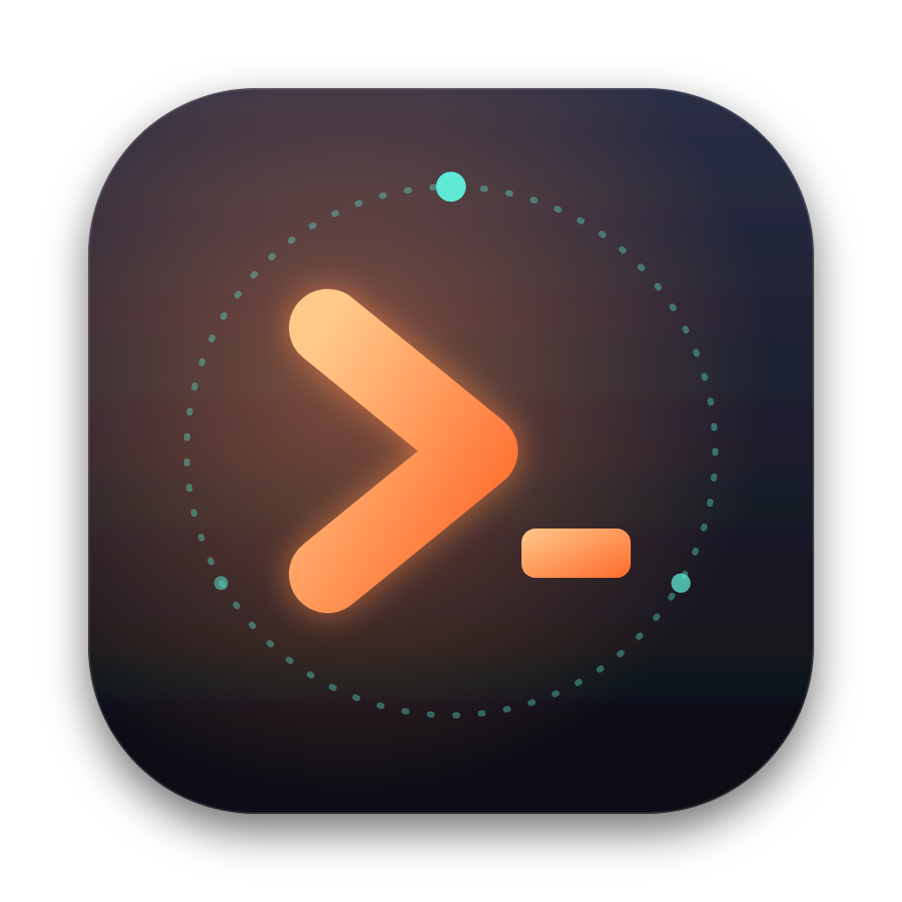

<p align="center">
  
</p>

<h1 align="center">Jaffer</h1>
<p align="center"><b>The terminal with one session that never ends — and a memory that keeps learning from you.</b></p>

Jaffer is a macOS terminal built for working with AI agents — Claude Code above all. Two ideas set it apart from Ghostty, Orca and friends:

1. **One session, always.** There are no tabs of throw-away shells and no "new chat". Your shell, its running processes, your scrollback and your agent conversation live in a background daemon. Quit the app, close the lid, reboot — you come back to exactly where you were (after a reboot: same folder, same screen, same conversation).
2. **A memory that evolves by itself.** Jaffer watches what you do, distils what is worth keeping — your preferences, each project's conventions, fixes that cost you an hour, routines you repeat — merges what repeats, lets stale things fade, and hands the result to every agent you use. You can see all of it, edit it, pin it, and **undo any change**.

And **Claude Code runs inside it like it would anywhere else**: real TTY, truecolor, mouse, bracketed paste, `Shift+Enter` for new lines, desktop notifications. A running Claude Code session survives quitting the app.

## Install

**Download** the `.dmg` for your Mac (Apple Silicon: `arm64`, Intel: `x64`) from [Releases](https://github.com/jafforgehq/jaffer/releases). Releases are only notarised if the maintainer has configured Apple credentials; if macOS says the app is damaged or from an unidentified developer, run once:

```sh
xattr -dr com.apple.quarantine /Applications/Jaffer.app
```

**Latest build from `main`:** every push builds both Macs in CI — open the newest run under *Actions → CI* and download the `Jaffer-macOS` artifact (`.dmg` and `.zip` for `arm64` and `x64`).

**Maintainers:** `git tag v0.1.0 && git push --tags` publishes those files as a GitHub Release.

**Or build it yourself** (a locally built app opens with no warnings):

```sh
git clone https://github.com/jafforgehq/jaffer && cd jaffer
./scripts/install-mac.sh        # needs Node 22+; builds and copies Jaffer.app to /Applications
```

On first launch Jaffer asks what it may do (learn from your sessions, connect Claude Code, share memory with other agents). Nothing is on until you say so.

## A 60-second tour

| | |
|---|---|
| `⌘J` | Agent panel — a Claude-powered agent that works **in your own shell**: its commands are typed into your terminal where you can watch them, and it shares your cwd, env vars and virtualenvs. It asks before it changes anything. |
| `⇧⌘M` | Memory panel — everything Jaffer has learned: *Learned*, *Skills*, *Activity* (every change, with Undo), *Notes* (yours). |
| `⌘P` | Command palette — or just type a request and press ↵ to hand it to the agent. |
| `⇧⌘C` | Run Claude Code in the current terminal. |
| `⌘D` / `⇧⌘D` | Split right / down. Splits are extra shells in the *same* session. |
| `⌘K` · `⌘F` · `⌘+` `⌘-` | Clear · find · text size. `⌘←/→/⌫` edit the line like in Terminal.app. |
| `⌃`` ` | Global hotkey: summon Jaffer from anywhere (configurable). |
| drag a file in | pastes its escaped path — handy for Claude Code. |

Closing the window hides it; `⌘Q` quits the app **but your session keeps running**. `⌥⌘Q` ends the session on purpose.

## Claude Code, first class

```sh
jaffer setup claude        # or: Settings → Claude Code → Connect
```

This is one reversible step (`jaffer setup claude --remove`) that wires Claude Code to Jaffer's memory in four ways:

- **MCP server** (`jaffer mcp`): `jaffer_context`, `jaffer_recall`, `jaffer_remember`, `jaffer_forget` — Claude can look things up and save lessons itself.
- **SessionStart hook**: every Claude Code session — including after `/compact` — starts with what Jaffer knows about *this project* and *you*.
- **Stop hook** + **transcript learning**: Jaffer reads Claude Code's local transcripts (read-only) and learns from them, whether you ran it in Jaffer or anywhere else.
- **Optional exports**: a clearly-marked block in `~/.claude/CLAUDE.md` (and `~/.codex/AGENTS.md`, `~/.gemini/GEMINI.md`), and learned routines published as real Claude Code **skills**.

Your own hooks and settings are never touched — only entries tagged `jaffer-managed` are added or removed.

## How the memory evolves

```
 what you do ──► episodes ──► reflect ──► memory items ──► consolidate ──► (decay / archive)
 commands, agent   redacted      offline rules always;     preference · convention ·    merge duplicates,
 chats, Claude     local log     a model curates when      workflow · lesson · fact ·   cap sizes, fade what
 Code transcripts                you allow it              project · environment        is never reinforced
                                      │                         │
                                      ▼                         ▼
                              skills (repeated routines)   injected into agents as *deltas*
```

- **Observe.** Shell integration (OSC 133/633 marks injected without touching your dotfiles) records commands, exit codes and working directories. Agent conversations and Claude Code transcripts are added. Everything is redacted for secrets before it is written.
- **Reflect** automatically — every ~20 events, or after you go idle. Deterministic rules always run (package manager per project, how to test/build, failure→fix pairs that recur, repeated routines → skills, directives like "always use pnpm"). With your consent, a model also curates: add, reinforce, update, merge, contradict, forget. Corrections ("no, use pnpm") are the strongest signal.
- **Consolidate** daily: merge near-duplicates, fade memories that are never reinforced (per-kind half-lives; pinned items never fade), enforce size caps.
- **Inject** without wasting context: the built-in agent sees only memory it hasn't seen yet in the conversation (append-only, cache-friendly); Claude Code gets it via hooks/MCP.
- **Stay in control.** Every mutation is journaled with before/after state. `jaffer memory log`, `jaffer memory revert <run>`, or the Undo button. `~/.jaffer/memory/NOTES.md` is yours and never rewritten.

Privacy: memory lives in `~/.jaffer/memory` on your Mac. Secrets (API keys, tokens, private keys, passwords in flags/env/URLs, high-entropy blobs) are redacted before anything is stored or sent; commands like `env`, `cat ~/.ssh/…`, `security find-…` or lines starting with a space are never recorded. The only network traffic is what *you* enable: the built-in agent (Anthropic API) and optional model curation of redacted summaries — done with your API key, or, if you only have Claude Code, through your own `claude -p` login. Your API key is stored in the macOS Keychain.

## One session, for real

The Jaffer app is a window onto a background **session daemon** (`jafferd`, a unix socket in `~/.jaffer/run`) that owns your shell(s), a headless copy of the terminal screen, the agent conversation and the memory. Re-attaching restores the exact screen — including full-screen programs and Claude Code's UI. If the daemon itself restarts (update, reboot) the shell starts in the same folder with the previous screen above it and the conversation continues; very long conversations are compacted into a briefing so the session can run for months.

## Command line

```
jaffer remember "Always run the linter before committing" --kind convention
jaffer recall linter          jaffer forget linter          jaffer context
jaffer memory [list|log|reflect|consolidate]    jaffer memory revert <runId>
jaffer ask "why is the build failing?"          jaffer status | doctor
jaffer setup claude [--remove|--status]         jaffer key set
```

Inside Jaffer, `jaffer` is on your `PATH` automatically; elsewhere, run *Install the `jaffer` command* from the palette.

## Development

```sh
npm ci
npm run build          # esbuild: daemon, CLI, Electron main/preload, renderer
npm run dev            # build + launch Electron
npm run typecheck && npm test
npm run test:e2e       # drives the real UI in headless Chromium against the real daemon (set JAFFER_CHROME)
npm run dist:mac       # dmg + zip for arm64 and x64
```

`src/core` (session, memory, agent, MCP) has no Electron dependency, so almost everything is tested as real processes: real PTYs with bash and zsh, the real `claude` binary (MCP registration and the TUI running in the PTY), the real Anthropic SDK against a mock Messages API, the bundled daemon and CLI as separate processes, and the renderer in headless Chromium. CI runs the whole suite on Linux **and macOS**, then builds the `.app`, boots the packaged app in a smoke test (`JAFFER_SMOKE=1`), and uploads the dmg/zip. See [docs/ARCHITECTURE.md](docs/ARCHITECTURE.md).

## What is verified, and how

| Claim | Evidence |
|---|---|
| Claude Code runs inside the terminal | the real `claude` TUI is started in a Jaffer PTY and receives keystrokes; the screen restores from a snapshot |
| Claude Code starts with your memory | the real `claude` binary, pointed at a mock API, fires the SessionStart hook and the model receives the memory |
| The MCP server works with Claude Code | `claude mcp add-json` + `claude mcp list` reports it connected |
| One session survives the app | black-box tests restart clients and the daemon: same shell PID, same screen, same cwd, same conversation |
| Memory evolves without being asked | the bundled daemon learns from shell activity, a Claude Code transcript and a (mock) model pass, then the run is undone |
| zsh, bash 3.2 and bash 5 integration | tests run against real shells on Linux and on GitHub's macOS runners |
| The packaged `.app` boots on macOS | CI builds the `.app`, launches it (`JAFFER_SMOKE=1`) and checks daemon, shell, preload bridge and renderer |
| The UI works | 11 Playwright tests drive the real UI against the real daemon |

Not verified (needs a person at a Mac): Keychain prompts, notifications, the global hotkey, vibrancy, and the look of the WebGL renderer on your GPU; and everything that needs a live Anthropic API key (the agent is tested against a mock Messages API through the real SDK).

## Limitations

- macOS is the target. Releases are unsigned unless the maintainer adds Apple credentials as repository secrets (`MAC_CERT_P12_BASE64`, `MAC_CERT_PASSWORD`, `APPLE_ID`, `APPLE_APP_SPECIFIC_PASSWORD`, `APPLE_TEAM_ID`).
- fish integration is experimental; zsh and bash are tested in CI.
- The agent panel needs an Anthropic API key. Claude Code in the terminal needs none beyond your own login, and memory curation can use that login too.
- Built on xterm.js (WebGL). It is fast, but not a native GPU terminal like Ghostty.

MIT licensed.
