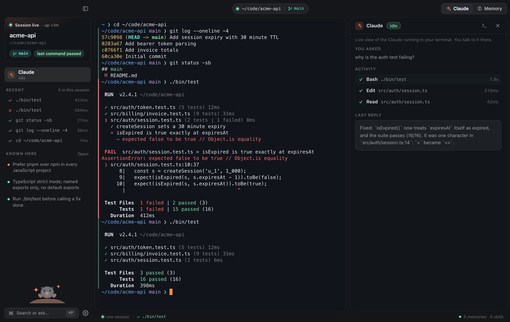
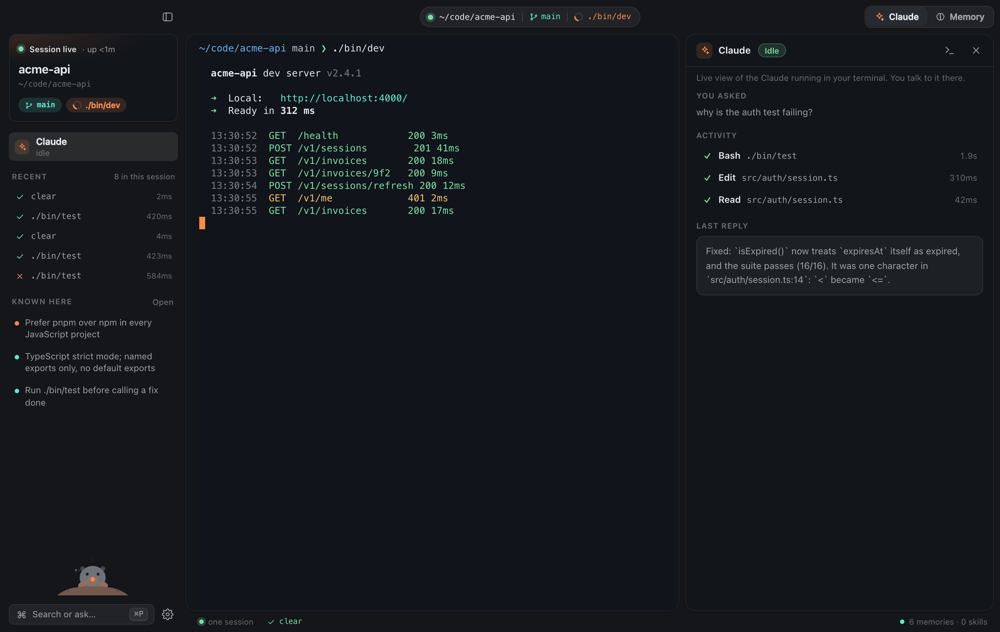
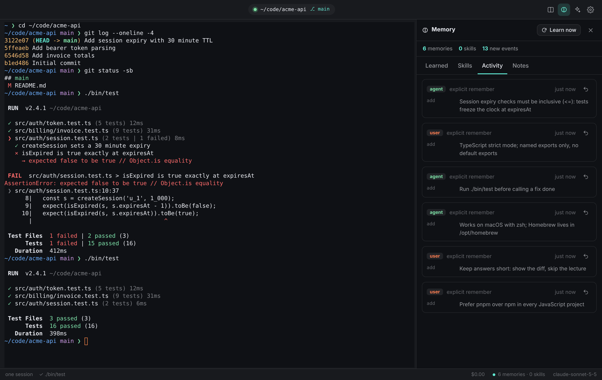
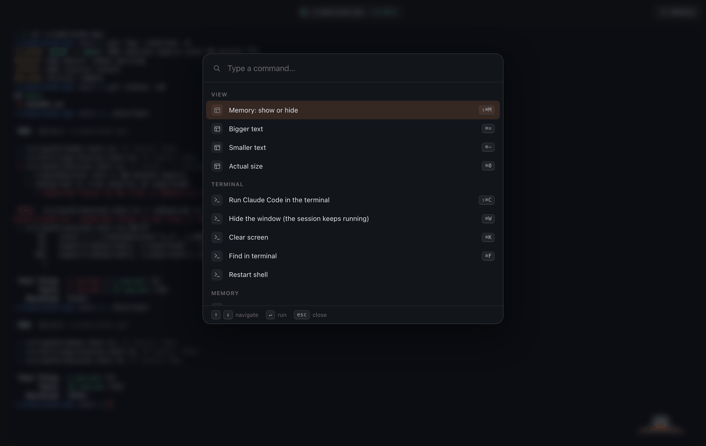
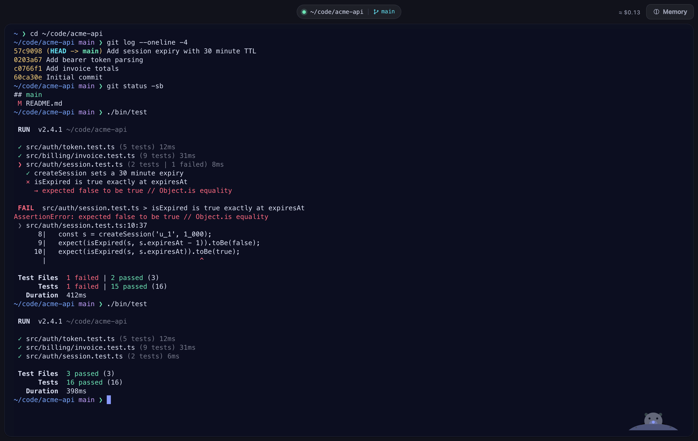

<p align="center">
  
</p>

<h1 align="center">Jaffer</h1>
<p align="center"><b>The terminal with one session that never ends — and a memory that keeps learning from you.</b></p>

Jaffer is a macOS terminal built for Claude Code. Two ideas set it apart from Ghostty, Orca and friends:

1. **One session, always.** There are no tabs of throw-away shells and no "new chat". Your shell, its running processes and your scrollback live in a background daemon. Quit the app, close the lid — you come back to exactly where you were, with a running Claude Code still going. (After a reboot: same folder, same screen above a fresh shell.)
2. **A memory that evolves by itself.** Jaffer watches what you do, distils what is worth keeping — your preferences, each project's conventions, fixes that cost you an hour, routines you repeat — merges what repeats, lets stale things fade, and hands the result to Claude Code. You can see all of it, edit it, pin it, and **undo any change**.

And **Claude Code runs inside it like it would anywhere else**: real TTY, truecolor, mouse, bracketed paste, `Shift+Enter` for new lines, desktop notifications. A running Claude Code session survives quitting the app.

<p align="center">
  
</p>
<p align="center"><sub>Claude Code runs in your own terminal, and the panel beside it shows what it is doing: the tools as they run, when it needs you, and its last reply. Green and red stripes in the gutter mark every command that worked or failed.</sub></p>

## Install

**Download** the `.dmg` for your Mac (Apple Silicon: `arm64`, Intel: `x64`) from [Releases](https://github.com/jafforgehq/jaffer/releases) and drag Jaffer to Applications. Each release says whether it is **signed and notarized** or an **unsigned preview**. Unsigned previews are blocked by Gatekeeper on first launch; after copying the app run once:

```sh
xattr -dr com.apple.quarantine /Applications/Jaffer.app
```

Every release also ships `SHA256SUMS.txt`. How releases get signed and notarized (on your Mac with `scripts/release-mac.sh`, or in CI with repository secrets) is in [docs/SIGNING.md](docs/SIGNING.md).

**Updates.** The signed app looks for new releases on GitHub (shortly after launch, then every few hours), downloads one in the background and then **asks**: *Update and restart* or *Later*. Updating restarts Jaffer and ends your terminal session, so the prompt says so, and says it again when Claude is working at that moment. Nothing is ever installed without your yes, not even when you quit. *Jaffer → Check for Updates…* answers on demand, and **Settings → Updates** turns the background check off. Unsigned builds (the previews CI makes, or one you built yourself) never update themselves.

**Latest build from `main`:** every push builds both Macs in CI. Open the newest run under *Actions → CI* and download the `Jaffer-macOS` artifact.

**Releases are automatic.** When a push to `main` passes the tests and the Mac build, CI publishes a release for the `version` in `package.json` (skipping it if that version already has one). To ship a new version, bump `version` and push. With Apple credentials configured the release is signed and notarized; without them it is published as a clearly marked unsigned pre-release. (Pushing a `vX.Y.Z` tag, or *Actions → CI → Run workflow* with a *release_tag*, works too.) A release made by CI is never marked *Latest*: installed apps follow the Latest release, which `scripts/release-mac.sh --publish` sets after it has uploaded the signed files and the update manifest.

**Or build it yourself** (a locally built app opens with no warnings):

```sh
git clone https://github.com/jafforgehq/jaffer && cd jaffer
./scripts/install-mac.sh        # needs Node 22+; builds and copies Jaffer.app to /Applications
```

On first launch Jaffer asks what it may do (sign in to Claude, learn from your sessions, show what Claude is doing in the panel). Nothing is on until you say so.

## What the window gives you

- **A live panel for the Claude in your terminal**: you talk to Claude Code in the terminal, on your own subscription (Claude Pro, Max, Team or Enterprise, no API key). The panel shows what it is doing (working, idle, or needs you), the tools it runs, its subagents and its last reply, and Jaffer notifies you when it is waiting for you. [How it works](#one-claude) is below.
- **A sidebar for the one session**: where it is (project, folder, branch), how long it has been alive, what is running right now, the live state of Claude Code, the last commands with exit status and timing, and what Jaffer knows about this project. Click a command to put it back on the prompt. `⌘B` hides it.
- **Command stripes**: a thin green or red bar in the terminal gutter for every finished command, drawn over the terminal so it never touches your scrollback.
- **Claude that shows its work**: every tool call as a row with its timing, file paths relative to your project, and a banner when Claude Code is waiting for your permission.
- **Memory you can read**: cards with kind, confidence, source and age; pinned items; a log of every change you can undo.
- **Eleven themes that restyle the whole app**, not just the terminal, picked from live previews in Settings.

## Screenshots

These are the real app, generated by `npm run screenshots` from a scripted demo session (a real git repo, a real zsh with Jaffer's shell integration, the live panel and the memory engine; only the Claude Code hook events are scripted, so the run is deterministic). Nothing is a mock-up.

| | |
|---|---|
| <br><sub>**It tells you when it needs you.** The panel, the sidebar and the status bar all say so, and Jaffer sends a notification if the window is in the background.</sub> | <br><sub>**Always know what is running.** The toolbar, the session card and the pane all show the live process.</sub> |
| <br><sub>**Memory you can see.** About you, per project, pinned items, confidence, and where each came from.</sub> | <br><sub>**Every change is logged and undoable.**</sub> |
| <br><sub>**Command palette** (`⌘P`): every action in one place.</sub> | <br><sub>**Light theme**, same layout.</sub> |
| <br><sub>**Jaffer Midnight**, one of eleven themes.</sub> | <br><sub>**Claude Code settings.** Connect it to Jaffer's memory and choose what Jaffer learns and shares; themes and more are in the other tabs.</sub> |
| <br><sub>**First launch.** Nothing is on until you say so.</sub> | |

## A 60-second tour

| | |
|---|---|
| `⌘B` | Session sidebar — project, Claude, recent commands, what Jaffer knows here. |
| `⌘J` | Claude panel — a live, read-only view of the Claude Code running in your terminal: what it is doing, the tools it runs, and when it needs you. You talk to Claude in the terminal, not here. |
| `⇧⌘M` | Memory panel — everything Jaffer has learned: *Learned*, *Skills*, *Activity* (every change, with Undo), *Notes* (yours). |
| `⌘P` | Command palette — every action in one place. |
| `⇧⌘C` | Run Claude Code in the current terminal. |
| `⌘K` · `⌘F` · `⌘+` `⌘-` | Clear · find · text size. `⌘←/→/⌫` edit the line like in Terminal.app. |
| `⌃`` ` | Global hotkey: summon Jaffer from anywhere (configurable). |
| drag a file in | pastes its escaped path — handy for Claude Code. |

Closing the window hides it (`⌘W`); `⌘Q` quits the app **but your session keeps running**. `⌥⌘Q` ends the session on purpose.

There is exactly **one session and one terminal**. Jaffer has no tabs, no splits and no second window, by design: everything you and Claude do happens in the same shell. (If a program needs its own screen, run it in that shell, or use `tmux` inside it.)

## One Claude

There is exactly one Claude in Jaffer: the `claude` running in your terminal (`⇧⌘C`, or just type `claude`). You talk to it there, with the full Claude Code you already know, including its own permission prompts. Jaffer does not put a second chat next to it.

The Claude panel (`⌘J`) is a live, read-only companion to that Claude. Claude Code reports what it is doing through its hooks, and the panel shows:

- a status: **Working**, **Idle** or **Needs you** (or **No session** when Claude Code is not running);
- the tool being run now, the recent tools with their timings, any subagents, and the start of its last reply;
- a banner when Claude Code is waiting for your permission. The sidebar and the status bar say so too, and Jaffer sends a desktop notification if the window is in the background.

It only reports a `claude` running in Jaffer's own terminal, never one in another terminal app, and everything it shows is redacted first. If you answer a permission prompt in the terminal, the panel notices that too.

Jaffer runs on Claude subscriptions only: there is no API-key option, and an `ANTHROPIC_API_KEY` in your environment is ignored. The first run starts with a **Sign in to Claude** step: it checks that Claude Code is installed and signed in (with `claude auth status`), opens your browser for the sign-in if not (`claude auth login`), and does not let you past until you are signed in. Nothing is typed into your terminal for it. If the login lapses later, the panel shows a banner with the same Sign-in button.

How it works: connecting Claude Code (below) adds hooks to `~/.claude/settings.json` that call `jaffer hook <event>`. They never delay Claude Code (they run asynchronously), print nothing, and do nothing when Claude Code is run outside Jaffer's terminal or when the daemon is not running.

## Claude Code, first class

```sh
jaffer setup claude        # or: Settings → Claude Code → Connect
```

This is one reversible step (`jaffer setup claude --remove`) that wires Claude Code to Jaffer in five ways:

- **MCP server** (`jaffer mcp`): `jaffer_context`, `jaffer_recall`, `jaffer_remember`, `jaffer_forget` — Claude can look things up and save lessons itself.
- **SessionStart hook**: every Claude Code session — including after `/compact` — starts with what Jaffer knows about *this project* and *you*.
- **Stop hook** + **transcript learning**: Jaffer reads Claude Code's local transcripts (read-only) and learns from them, whether you ran it in Jaffer or anywhere else.
- **Live hooks**: asynchronous hooks for prompts, tool calls, subagents, notifications and the end of a session feed the live panel. They only report from Jaffer's own terminal.
- **Optional exports**: a clearly-marked block in `~/.claude/CLAUDE.md`, and learned routines published as real Claude Code **skills**.

Your own hooks and settings are never touched — only entries tagged `jaffer-managed` are added or removed.

## How the memory evolves

```
 what you do ──► episodes ──► reflect ──► memory items ──► consolidate ──► (decay / archive)
 commands, Claude    redacted      offline rules always;     preference · convention ·    merge duplicates,
 Code transcripts   local log     a model curates when      workflow · lesson · fact ·   cap sizes, fade what
                                 you allow it              project · environment        is never reinforced
                                      │                         │
                                      ▼                         ▼
                              skills (repeated routines)   injected into Claude Code as *deltas*
```

- **Observe.** Shell integration (OSC 133/633 marks injected without touching your dotfiles) records commands, exit codes and working directories. Claude Code transcripts are added. Everything is redacted for secrets before it is written.
- **Reflect** automatically — every ~20 events, or after you go idle. Deterministic rules always run (package manager per project, how to test/build, failure→fix pairs that recur, repeated routines → skills, directives like "always use pnpm"). With your consent, a model also curates: add, reinforce, update, merge, contradict, forget. Corrections ("no, use pnpm") are the strongest signal.
- **Consolidate** daily: merge near-duplicates, fade memories that are never reinforced (per-kind half-lives; pinned items never fade), enforce size caps.
- **Inject** without wasting context: Claude Code gets what is relevant to the project at the start of each session (SessionStart hook) and can ask for more through the MCP server.
- **Stay in control.** Every mutation is journaled with before/after state. `jaffer memory log`, `jaffer memory revert <run>`, or the Undo button. `~/.jaffer/memory/NOTES.md` is yours and never rewritten.

Privacy: memory lives in `~/.jaffer/memory` on your Mac. Secrets (API keys, tokens, private keys, passwords in flags/env/URLs, high-entropy blobs) are redacted before anything is stored or sent; commands like `env`, `cat ~/.ssh/…`, `security find-…` or lines starting with a space are never recorded. The only network traffic is what *you* enable: the Claude panel and optional model curation of redacted summaries, both through your own Claude Code login (`claude -p`). Jaffer never stores an API key.

## One session, for real

The Jaffer app is a window onto a background **session daemon** (`jafferd`, a unix socket in `~/.jaffer/run`) that owns your shell, a headless copy of the terminal screen, what Claude Code is doing and the memory. Re-attaching restores the exact screen, including full-screen programs and Claude Code's UI. If the daemon itself restarts (update, reboot) the shell starts in the same folder with the previous screen above it.

## Command line

```
jaffer remember "Always run the linter before committing" --kind convention
jaffer recall linter          jaffer forget linter          jaffer context
jaffer memory [list|log|reflect|consolidate]    jaffer memory revert <runId>
jaffer status | doctor
jaffer setup claude [--remove|--status]
```

Inside Jaffer, `jaffer` is on your `PATH` automatically; elsewhere, run *Install the `jaffer` command* from the palette.

## Development

```sh
npm ci
npm run build          # esbuild: daemon, CLI, Electron main/preload, renderer
npm run dev            # build + launch Electron
npm run typecheck && npm test
npm run test:e2e       # drives the real UI in headless Chromium against the real daemon (set JAFFER_CHROME)
npm run dist:mac       # dmg + zip for arm64 and x64 (ad-hoc signed; see docs/SIGNING.md for Developer ID)
npm run screenshots    # regenerates docs/screenshots from a scripted demo session
python3 scripts/shrink-screenshots.py   # (optional) quantize them, about 60% smaller
scripts/release-mac.sh # on your Mac: sign, notarize, verify and publish a release
```

`src/core` (session, memory, Claude Code integration, MCP) has no Electron dependency, so almost everything is tested as real processes: real PTYs with bash and zsh, the real `claude` binary (MCP registration and the TUI running in the PTY), the real `claude` against a mock Messages API, the bundled daemon and CLI as separate processes, and the renderer in headless Chromium. CI runs the whole suite on Linux **and macOS**, then builds the `.app`, boots the packaged app in a smoke test (`JAFFER_SMOKE=1`), and uploads the dmg/zip. See [docs/ARCHITECTURE.md](docs/ARCHITECTURE.md).

## What is verified, and how

| Claim | Evidence |
|---|---|
| Claude Code runs inside the terminal | the real `claude` TUI is started in a Jaffer PTY and receives keystrokes; the screen restores from a snapshot |
| Claude Code starts with your memory | the real `claude` binary, pointed at a mock API, fires the SessionStart hook and the model receives the memory |
| The MCP server works with Claude Code | `claude mcp add-json` + `claude mcp list` reports it connected |
| One session survives the app | black-box tests restart clients and the daemon: same shell PID, same screen, same cwd |
| Memory evolves without being asked | the bundled daemon learns from shell activity, a Claude Code transcript and a (mock) model pass, then the run is undone |
| zsh, bash 3.2 and bash 5 integration | tests run against real shells on Linux (gates a release) and on GitHub's macOS runners (advisory: shown in every run, but a flaky timing test there does not block a release) |
| The packaged `.app` boots on macOS | CI builds the `.app`, launches it (`JAFFER_SMOKE=1`) and checks daemon, shell, preload bridge and renderer |
| The UI works | Playwright tests drive the real UI against the real daemon |
| The panel follows the terminal's Claude | real Claude Code hook payloads drive a state machine; the real built `jaffer hook` reports to the bundled daemon (and stays silent and fast when it cannot, or outside Jaffer's terminal); the UI test watches the panel go working, needs you, idle; declining a prompt in the terminal is noticed from the transcript |
| Signing is configured correctly | CI's *Signing dry run* signs the app with a throwaway self-signed identity through the same electron-builder path as a release, then checks every nested binary (including the native terminal addon), the hardened runtime, the entitlements, the signed dmg, and that the signed app still starts its daemon and shell |

Not verified here: **a real Claude sign-in** (the Claude Code tests use the real `claude` binary but a mock model API, so your plan's limits are untested, and the first-run sign-in step is tested against a stand-in `claude` that answers `auth status` and `auth login`, not against Anthropic's real login page), the live panel against a real Claude Code session on the real API (its hook events were observed against a mock API), and **Apple trust and notarization**, which need your Developer ID certificate (see [docs/SIGNING.md](docs/SIGNING.md)). Also not verified (needs a person at a Mac): Keychain prompts, notifications, the global hotkey, vibrancy, and the look of the WebGL renderer on your GPU; and everything that needs a live Anthropic API key (the agent is tested against a mock Messages API through the real SDK).

## Limitations

- macOS is the target. Releases are signed and notarized only when the maintainer has run `scripts/release-mac.sh` on a Mac with a Developer ID certificate or added the Apple credentials as repository secrets ([docs/SIGNING.md](docs/SIGNING.md)); otherwise they are published as unsigned pre-releases.
- fish integration is experimental; zsh and bash are tested in CI.
- The Claude panel is read-only and shows a `claude` running in Jaffer's own terminal, once Claude Code is connected (`jaffer setup claude`). Answering Claude Code's permission prompts from the panel is not built yet: you answer them in the terminal.
- Built on xterm.js (WebGL). It is fast, but not a native GPU terminal like Ghostty.

MIT licensed.
