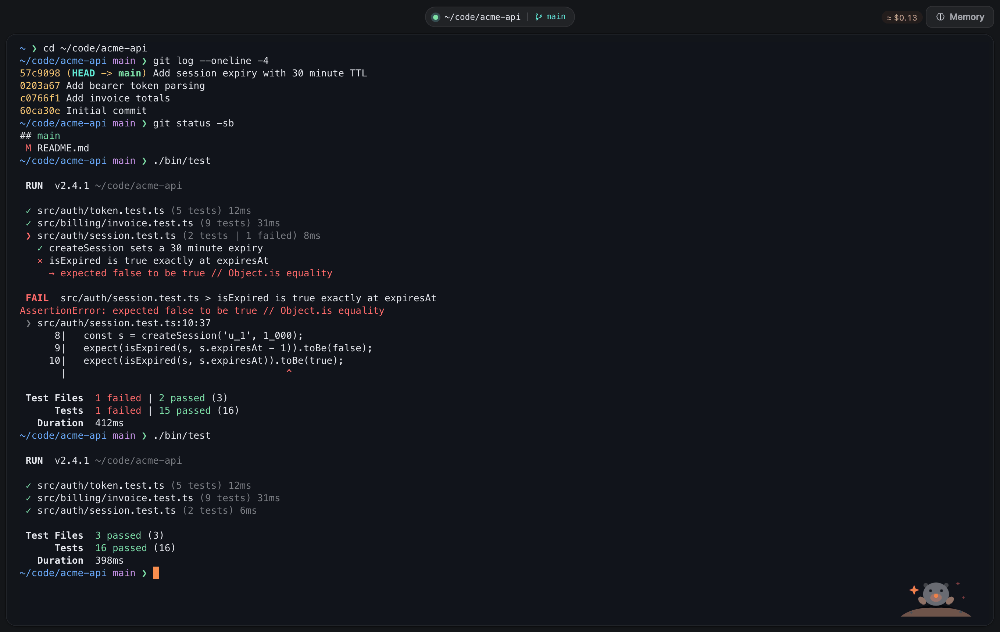
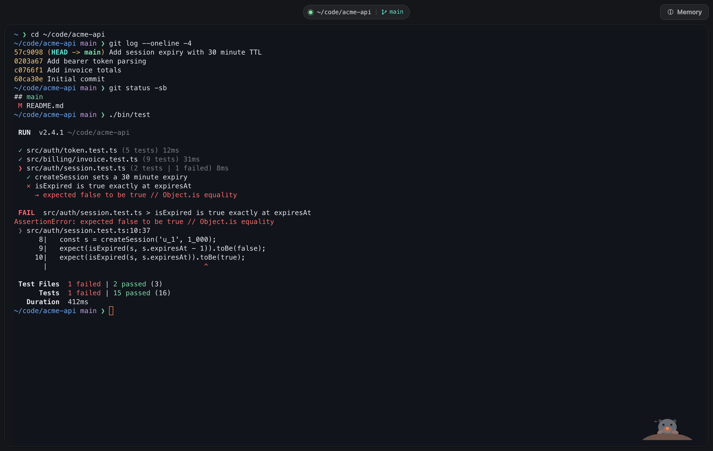
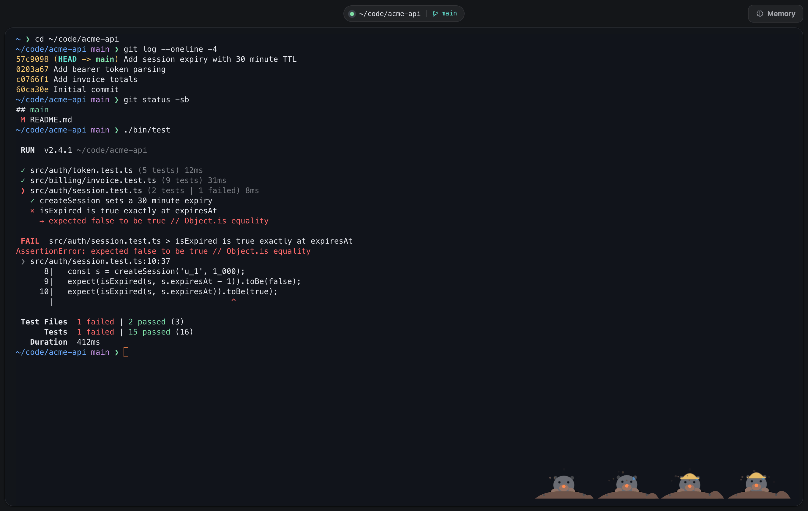
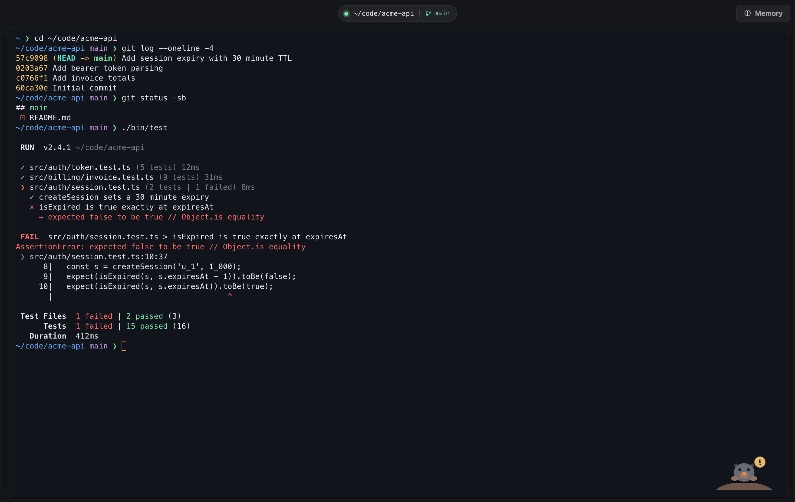
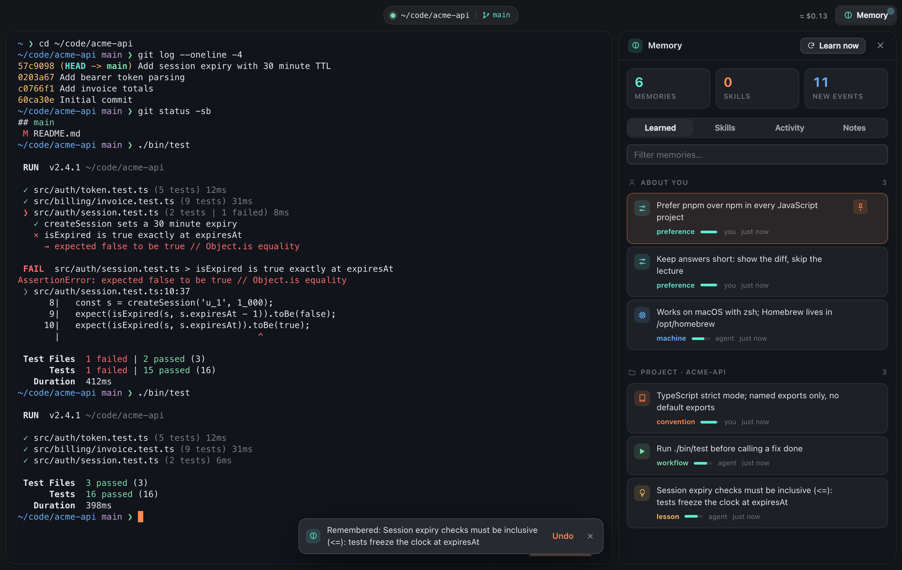
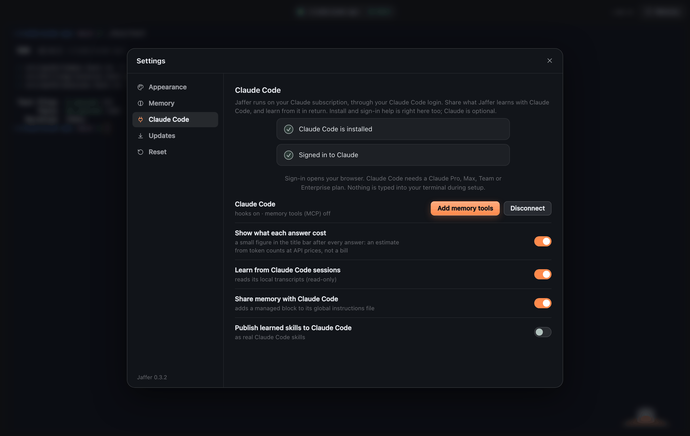
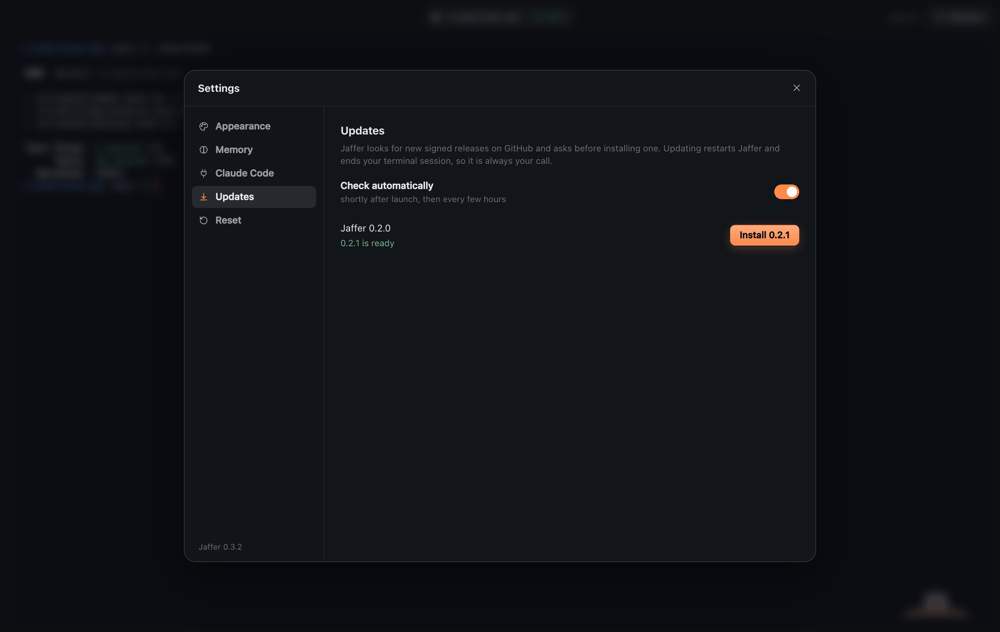
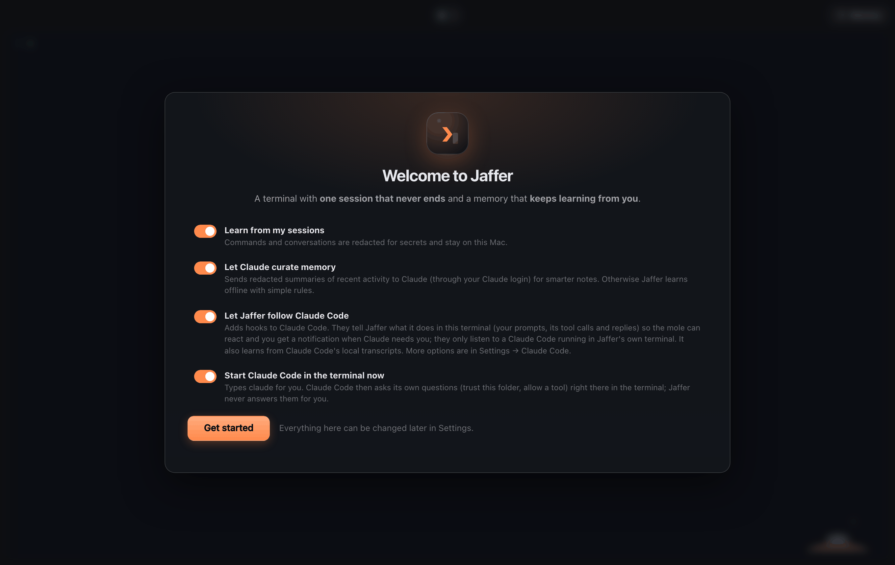
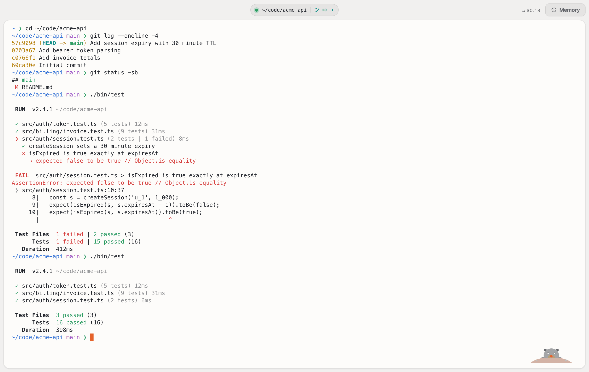

<p align="center">
  
</p>

<h1 align="center">Jaffer</h1>
<p align="center"><b>A calm terminal with one session that never ends, a memory that keeps learning from you, and a little mole that shows when something is happening.</b></p>

Jaffer is a macOS terminal with nothing around it: no sidebars, no panels. Three things set it apart:

1. **One session, always.** No tabs of throw-away shells, no "new chat". Your shell, its processes and your scrollback live in a background daemon: quit the app, close the lid, and you come back to exactly where you were, with a running Claude Code still going. (After a reboot: same folder, same screen above a fresh shell.)
2. **A memory that evolves by itself.** Jaffer distils what is worth keeping from what you do (preferences, each project's conventions, fixes that cost you an hour, routines you repeat), merges what repeats, lets stale things fade and hands the result to Claude Code. You can see it, edit it, pin it and **undo any change**.
3. **Life when something happens.** A mole in the corner of the terminal sleeps when nothing runs, digs while a command or Claude works, sits up with a `!` when Claude needs you and cheers when a turn ends.

**Claude Code is optional**, and runs inside Jaffer like anywhere else (real TTY, truecolor, mouse, `Shift+Enter`). Connect it and the mole, the notifications and a per-answer cost figure follow it.

<p align="center">
  
</p>
<p align="center"><sub>Just the terminal. The mole cheers because a turn just ended; the small <code>≈ $0.13</code> beside Memory is what that answer was worth at API list prices.</sub></p>

## Install

Download the `.dmg` for your Mac (Apple Silicon `arm64`, Intel `x64`) from [Releases](https://github.com/jafforgehq/jaffer/releases) and drag Jaffer to Applications. Releases are signed and notarized; an unsigned preview (built by CI) needs `xattr -dr com.apple.quarantine /Applications/Jaffer.app` once. Every release has a `SHA256SUMS.txt`; how they are signed and published is in [docs/SIGNING.md](docs/SIGNING.md).

**Updates ask first** (from 0.2.0 on). The signed app looks for a new release, downloads it in the background and then asks: *Update and restart* or *Later*. Updating ends your terminal session, so the prompt says so; nothing installs without your yes, not even on quit. Turn the background check off in *Settings → Updates*.

**Or build it** (a local build opens with no warnings): `./scripts/install-mac.sh` (needs Node 22+).

On first launch Jaffer asks what it may do: sign in to Claude or use a plain terminal, learn from your sessions, follow Claude Code, start `claude` for you. Nothing is on until you say so.

## What you get

- **A terminal and nothing around it.** A thin title bar shows the folder, the branch and what is running (a ring spins only while something really works).
- **A mole that means something.** It digs while a command or Claude works, and **the longer it takes, the harder it digs**: faster after 30 seconds, sweating after 2 minutes, a hard hat and a growing pile after 5. **Every background agent brings a helper mole** (up to three) that cheers when its agent finishes. Off in *Settings → Appearance* (*Pet*, *Animations*); it also stands still under macOS *Reduce motion*.
- **What each answer cost.** After every Claude Code answer a figure like `≈ $0.04` appears in the title bar; hover for the tokens and the session total. It is an **estimate**: Jaffer adds up the token counts in Claude Code's own transcript (numbers only, never the words) at Anthropic's API list prices. On a subscription nothing is billed per token, so read it as what the work would be worth. A model without a known price shows tokens, not a guess; background agents' own usage is not counted. Off in *Settings → Claude Code*.
- **Memory you can read** (`⇧⌘M`): cards with kind, confidence, source and age, pinned items and a log of every change with *Undo*. It only interrupts you for something new it learned.
- **A notification when Claude needs you** (and when a long command finishes) while the window is in the background.
- **Eleven themes** that restyle the whole app, previewed live in Settings.

Keys: `⇧⌘M` memory · `⌘P` command palette · `⇧⌘C` run Claude Code · `⌘K` clear · `⌘F` find · `⌘+`/`⌘-` text size · `` ⌃` `` summon Jaffer from anywhere · drag a file in to paste its path. `⌘W` hides the window and `⌘Q` quits the app, **but the session keeps running**; `⌥⌘Q` ends it. There is exactly one session and one terminal, by design (use `tmux` inside it if you want panes).

| | |
|---|---|
| <br><sub>**Alive while Claude works.** The mole digs, dirt flying.</sub> | <br><sub>**A helper per background agent.** Three agents, three helpers; the one that has been at it longest sweats under a hard hat.</sub> |
| <br><sub>**It tells you when it needs you.** The mole sits up with a `!`, and a notification follows if the window is behind.</sub> | <br><sub>**Memory you can see** (`⇧⌘M`), where each item came from, every change undoable.</sub> |
| <br><sub>**Claude Code settings:** sign-in help, the hooks, memory tools, and the cost switch.</sub> | <br><sub>**Updates ask first**, because updating ends your terminal session.</sub> |
| <br><sub>**First launch.** Nothing is on until you say so; a plain terminal is one click.</sub> | <br><sub>**Light theme**, same calm layout (one of eleven).</sub> |

<sub>The screenshots are the real app, generated by `npm run screenshots` from a scripted demo session (real git repo, real zsh, real memory engine; only Claude Code's hook events and its token counts are scripted so the run is deterministic).</sub>

## Claude Code, if you want it

There is exactly one Claude: the `claude` in your terminal (`⇧⌘C`, or just type it). You talk to it there, with its own permission prompts; Jaffer adds no second chat or panel. Claude Code reports what it does through hooks, and Jaffer turns that into the mole, the title-bar ring, the notification and the cost figure. It only follows a `claude` running in Jaffer's own terminal, redacts everything it handles, and notices a declined prompt or `Esc` from the transcript (Claude Code fires no hook for those).

Jaffer runs on Claude **subscriptions** only: no API key anywhere (`ANTHROPIC_API_KEY` is ignored), and whether you are signed in comes from `claude auth status`. Sign-in opens your browser and nothing is typed into your terminal for it.

`jaffer setup claude` (or *Settings → Claude Code → Add memory tools*) wires Claude Code in fully and reversibly (`--remove`):

- an **MCP server** (`jaffer_context`, `jaffer_recall`, `jaffer_remember`, `jaffer_forget`) so Claude can look things up and save lessons itself;
- a **SessionStart hook**: every session, also after `/compact`, starts with what Jaffer knows about this project and you;
- a **Stop hook** and **transcript learning** (local, read-only), whether you ran Claude in Jaffer or elsewhere;
- **live hooks** (prompts, tools, subagents, notifications), which only report from Jaffer's terminal and never delay Claude;
- optional exports: a marked block in `~/.claude/CLAUDE.md`, and learned routines published as real Claude Code skills.

Your own hooks and settings are never touched, only entries tagged `jaffer-managed`.

## How the memory evolves

- **Observe.** Shell integration records commands, exit codes and folders (no dotfile edits), and Claude Code transcripts are added. Everything is redacted for secrets before it is written.
- **Reflect** every ~20 events or when you go idle. Deterministic rules always run (package manager, how to test and build, recurring failure→fix pairs, repeated routines, "always use pnpm"); with your consent a model also curates, and a correction ("no, use pnpm") is the strongest signal.
- **Consolidate** daily: merge near-duplicates, fade what is never reinforced (pinned items never fade), cap sizes.
- **Inject** only what is relevant to the project, at session start or on request through MCP.
- **Stay in control.** Every change is journaled: `jaffer memory log`, `jaffer memory revert <run>` or the Undo button. `~/.jaffer/memory/NOTES.md` is yours and never rewritten.

Memory lives in `~/.jaffer/memory`. Secrets (keys, tokens, passwords in flags, env or URLs, high-entropy blobs) are redacted before anything is stored or sent, and commands like `env` or `cat ~/.ssh/…` are never recorded. The only network traffic is what you enable: model curation of redacted summaries, through your own Claude login (`claude -p`).

## One session, the command line, a clean start

The app is a window onto a background daemon (`jafferd`, a unix socket in `~/.jaffer/run`) that owns your shell, a headless copy of the screen, what Claude Code is doing and the memory. Re-attaching restores the exact screen, including full-screen programs.

```
jaffer remember "Always run the linter before committing" --kind convention
jaffer recall linter      jaffer forget linter      jaffer context
jaffer memory [list|log|reflect|consolidate|revert <run>]
jaffer status | doctor    jaffer setup claude [--remove|--status]
```

Inside Jaffer `jaffer` is already on your `PATH`; elsewhere run *Install the `jaffer` command* from the palette.

**Start over:** *Settings → Reset → Reset…*, or `jaffer reset` from another terminal (`--yes` skips the question, `--delete` skips the backup). It ends the session and removes Jaffer's folder `~/.jaffer` (moved aside as `~/.jaffer.backup-<time>` unless you delete it), its hooks and memory tools in Claude Code, the block it wrote into `~/.claude/CLAUDE.md`, the skills it published, the `jaffer` link and the app's data. Claude Code itself, its login and your own settings stay. Then drag Jaffer.app to the Trash and install the latest release.

## Development

```sh
npm ci && npm run build        # esbuild: daemon, CLI, Electron main/preload, renderer
npm run dev                    # build + launch
npm run typecheck && npm test  # real PTYs (bash, zsh), the bundled daemon and CLI as processes, the real `claude` against a mock API
npm run test:e2e               # the real UI in headless Chromium against the real daemon (set JAFFER_CHROME)
npm run screenshots            # regenerate docs/screenshots; then python3 scripts/shrink-screenshots.py
scripts/release-mac.sh         # on your Mac: build, sign, notarize, verify; --publish uploads it
```

`src/core` has no Electron dependency, so nearly everything is tested as real processes. CI runs the suite on Linux and macOS, builds the `.app`, boots it in a smoke test (`JAFFER_SMOKE=1`) and checks signing end to end with a throwaway identity. See [docs/ARCHITECTURE.md](docs/ARCHITECTURE.md).

**Not verified here:** a real Claude sign-in (tests use the real `claude` binary against a mock API and a stand-in for the login page); the mole and the cost figure against a real Claude Code session (their inputs were checked against real hook payloads and transcript fields, then driven by scripted events); clicking *Update and restart* through to the new version; and, needing a person at a Mac, notifications, the global hotkey and the WebGL renderer on your GPU.

## Limitations

- macOS only. Fish integration is experimental (zsh and bash are tested).
- No Claude panel by design: you answer Claude Code's permission prompts in the terminal.
- Built on xterm.js (WebGL): fast, but not a native GPU terminal like Ghostty.

MIT licensed.
